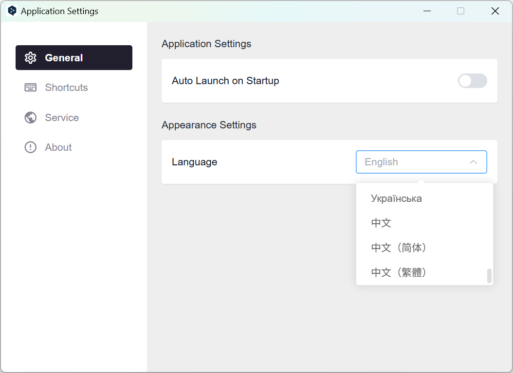
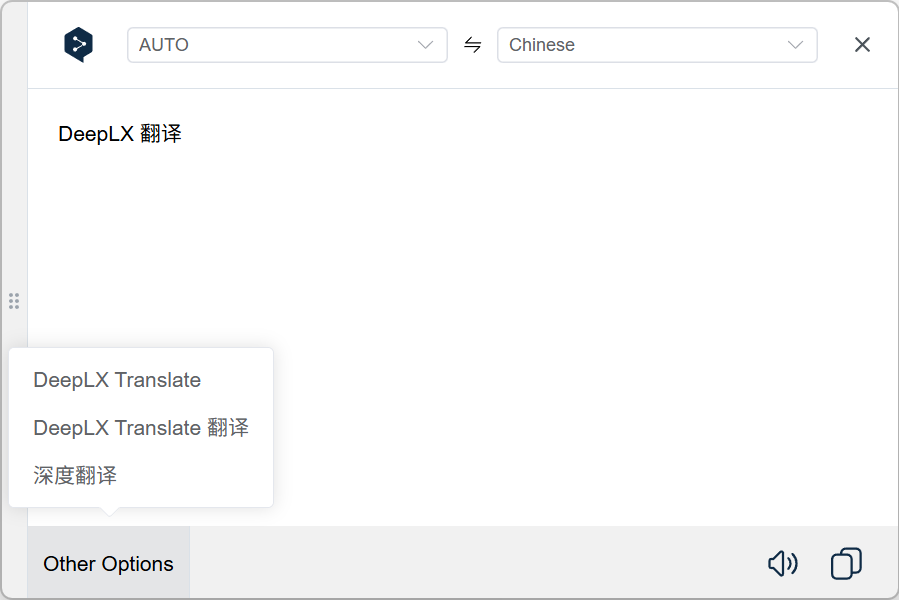

# DeepL Translate Unofficial

A cross-platform DeepL translation desktop tool built with [Tauri v2](https://github.com/tauri-apps/tauri) + [DeepLX API](https://github.com/Lete114/deeplx-serverless), lightweight, efficient, with a clean interface, supporting multiple platforms and languages to help you efficiently obtain high-quality translation results.

## 🖼️ Screenshots

<div>
   
   
</div>

## ⌨️ Shortcuts

- **Open Translation Window**: Super + ` (Super is usually Win or Cmd key)
- **Open Settings Window**: Alt + `

> All shortcuts can be customized in the application settings.

## ✨ Main Features

- ⚡ **Cross-platform**: Based on Tauri v2, supports Windows, macOS, Linux (x11), small size, fast startup, low resource usage.
- 🖥️ **Clean UI**: Interface style consistent with DeepL official, minimalist design, focused on translation experience.
- 🌍 **Multi-language Interface**: Built-in i18n internationalization, supports Chinese, English and other language interface switching.
- ⌨️ **Global Shortcuts**: Customizable global shortcuts for quick translation anytime, anywhere.
- 🔊 **Text-to-Speech**: Supports reading original text and translation, improving language learning efficiency.
- 📋 **Clipboard Operations**: One-click copy translation to clipboard, improving office efficiency.
- 📚 **Multiple Meanings Display**: Supports viewing multiple meanings of translations, meeting richer translation needs.
- 🛡️ **Privacy & Security**: Local data storage, API keys not uploaded to cloud, protecting user privacy.

## 🚀 Quick Start

### 1. Download and Install

Visit the [Releases](https://github.com/Lete114/DeepL-Translate-Unofficial/releases) page to download the installation package suitable for your system:

- Windows: `.msi` or `.exe`
- macOS: `.dmg`
- Linux: `.AppImage` or `.deb`

### 2. Get DeepLX API Service

- Recommended to self-host [DeepLX API](https://github.com/Lete114/deeplx-serverless) service, or use publicly available DeepLX instances.
- Fill in the API address in the settings interface (e.g., `http://localhost:1188/translate`).

### 3. Configure and Use

- After starting the application, click the system tray icon or use shortcuts to bring up the main interface.
- Customize global shortcuts, interface language, etc. in settings.
- Select text and use shortcuts for quick translation.
- Supports reading, copying, viewing multiple meanings and other operations.

## ⚙️ Local Development

If you need to participate in development or customize builds:

```bash
# Clone repository
git clone https://github.com/Lete114/DeepL-Translate-Unofficial.git
cd DeepL-Translate-Unofficial

# Install dependencies
pnpm install

# Start development mode
pnpm tauri dev

# Build production package
pnpm tauri build
```

## 🛠️ Tech Stack

- [Tauri v2](https://github.com/tauri-apps/tauri) - Cross-platform desktop application framework
- [Vue 3](https://vuejs.org/) - Frontend UI framework
- [TypeScript](https://www.typescriptlang.org/) - Type-safe development
- [Element Plus](https://element-plus.org/) - UI component library
- [Pinia](https://pinia.vuejs.org/) - State management
- [UnoCSS](https://github.com/unocss/unocss) - Atomic CSS
- [DeepLX API](https://github.com/Lete114/deeplx-serverless) - Unofficial DeepL translation API

## ❓ FAQ

1. **How to get DeepL API Key?**
   This project uses DeepLX API by default, no official [DeepLX API](https://github.com/Lete114/deeplx-serverless) Key required. You can self-host DeepLX service or use public services.

2. **Why does translation fail?**
   Please check if the DeepLX API service is available, or change the API address.

3. **How to customize shortcuts?**
   You can customize global shortcuts in the settings interface to avoid conflicts with system or other software.

4. **What languages are supported?**
   Supports all language pairs officially supported by DeepL, specifically selectable in the interface.

## 🤝 Contributing

Welcome to submit Issues, Pull Requests or suggestions to help improve the project!

1. Fork this repository and create a branch
2. Submit your changes
3. Create a Pull Request

## 📄 License

This project is licensed under [MIT License](LICENSE).

## 🙏 Acknowledgments

- [Tauri](https://tauri.app/)
- [Vue.js](https://vuejs.org/)
- [Element Plus](https://element-plus.org/)
- [UnoCSS](https://github.com/unocss/unocss)
- [DeepL](https://www.deepl.com/)
- [DeepLX](https://github.com/OwO-Network/DeepLX)
- [DeepLX-ServerLess](https://github.com/Lete114/deeplx-serverless)

If you find this project useful, welcome to ⭐️ Star support!
